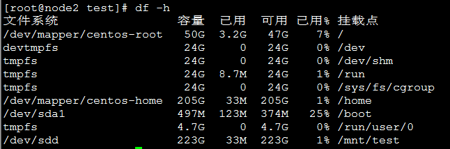
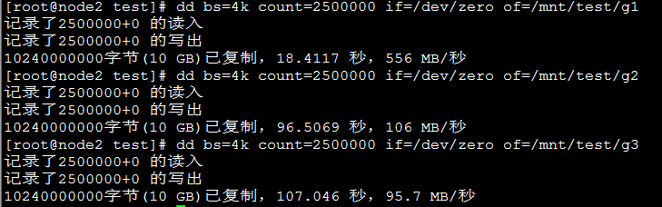
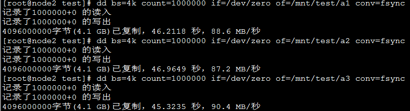
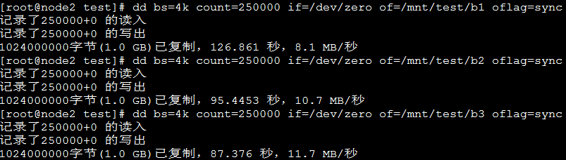
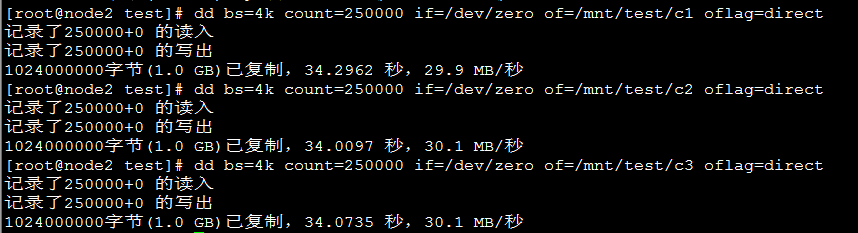
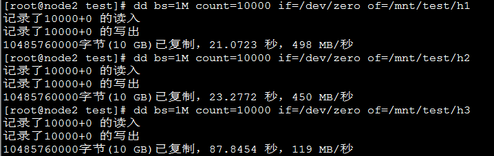
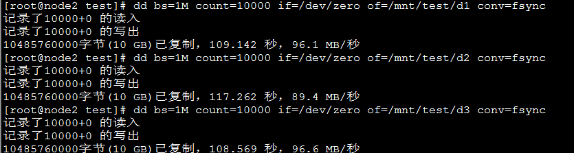
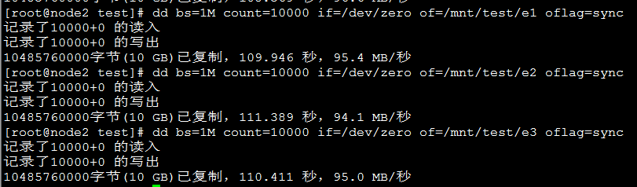
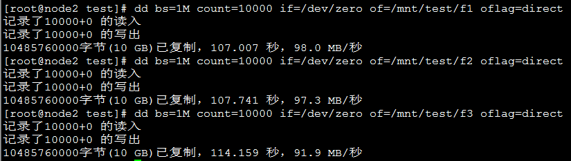

# dd写-ssd单盘

## 单机测试

**1.设备挂载**

在node2下，将ssd固态盘/dev/sdd挂载到/mnt/test下。

---

**2.bs=4k的写入速度**

输入

    dd bs=4k count=2500000 if=/dev/zero of=/mnt/test/g1

写10G文件，不加参数来回波动，不准确。

输入

    dd bs=4k count=1000000 if=/dev/zero of=/mnt/test/a1 conv=fsync

写4.1G文件，带**conv=fsync**参数，平均速度为**88.7MB/s**

输入

    dd bs=4k count=250000 if=/dev/zero of=/mnt/test/b1 oflag=sync

写1G文件，带**oflag=sync**参数，平均速度为**10.2MB/s**

输入

    dd bs=4k count=250000 if=/dev/zero of=/mnt/test/c1 oflag=direct

写1G文件，带**oflag=direct**参数，平均速度为**30MB/s**

---

**3.bs=1M的写入速度**

输入

    dd bs=1M count=10000 if=/dev/zero of=/mnt/test/h1

写10G文件，不加参数来回波动，不准确。

输入

    dd bs=1M count=10000 if=/dev/zero of=/mnt/test/d1 conv=fsync

写10G文件，带**conv=fsync**参数，平均速度为**94MB/s**

输入

    dd bs=1M count=10000 if=/dev/zero of=/mnt/test/e1 oflag=sync

写10G文件，带**oflag=sync**参数，平均速度为**95.2MB/s**

输入

    dd bs=1M count=10000 if=/dev/zero of=/mnt/test/f1 oflag=direct

写10G文件，带**oflag=direct**参数，平均速度为**95.7MB/s**

