# dd写-集群双网卡

## 集群测试(RBD-块存储)

**1.设备挂载**

在node1下，进入容器client创造块设备后，将块设备/dev/rbd0挂载到/mnt/test1下。

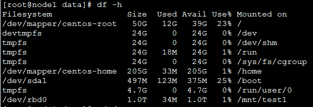

**2.bs=4k的写入速度**

输入

    dd bs=4k count=2500000 if=/dev/zero of=/mnt/test1/g1

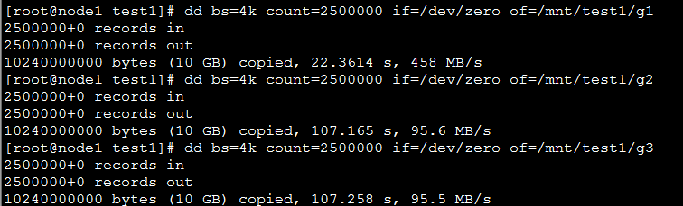

写10G文件，不加参数来回波动，不准确。

输入

    dd bs=4k count=1000000 if=/dev/zero of=/mnt/test1/a1 conv=fsync
    
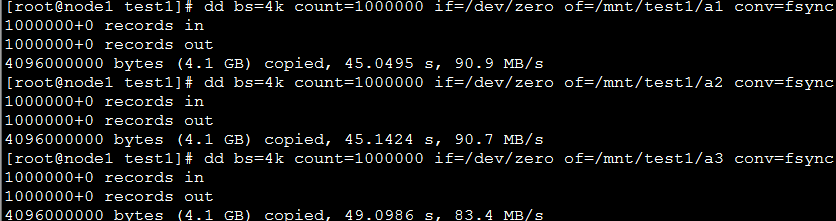

写4.1G文件，带**conv=fsync**参数，平均速度为**88.3MB/s**

输入

    dd bs=4k count=10000 if=/dev/zero of=/mnt/test1/b1 oflag=sync
    
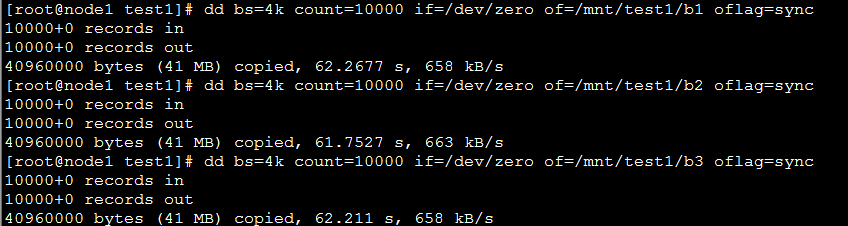

写40M文件，带**oflag=sync**参数，平均速度为**660KB/s**

输入

    dd bs=4k count=10000 if=/dev/zero of=/mnt/test1/c1 oflag=direct
    
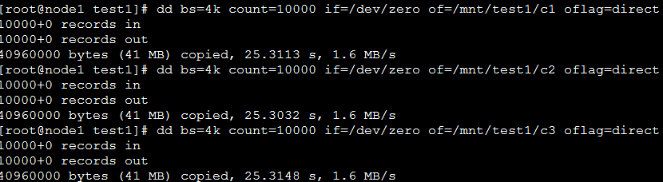

写40M文件，带**oflag=direct**参数，平均速度为**1.6MB/s**

**3.bs=1M的写入速度**

输入

    dd bs=1M count=10000 if=/dev/zero of=/mnt/test1/h1
    
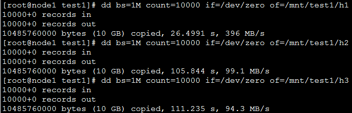

写10G文件，不加参数来回波动，不准确。

输入

    dd bs=1M count=1000 if=/dev/zero of=/mnt/test1/d1 conv=fsync
    
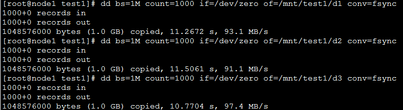

写1G文件，带**conv=fsync**参数，平均速度为**93.4MB/s**

输入

    dd bs=1M count=1000 if=/dev/zero of=/mnt/test1/e1 oflag=sync
    
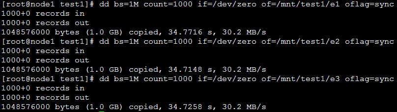

写1G文件，带**oflag=sync**参数，平均速度为**30.2MB/s**

输入

    dd bs=1M count=1000 if=/dev/zero of=/mnt/test1/f1 oflag=direct
    
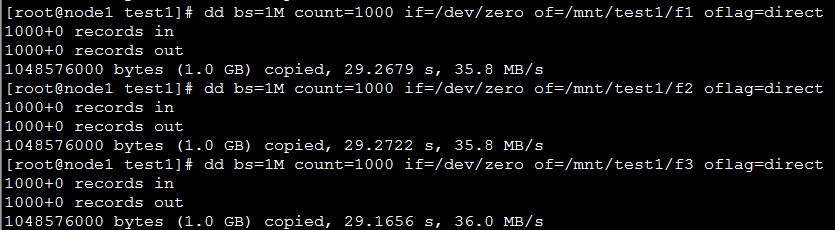

写1G文件，带**oflag=direct**参数，平均速度为**35.9MB/s**

---

## 集群测试(CephFS-文件存储)

**1.设备挂载**

将CephFS设备挂载到/mnt/cephfs下。

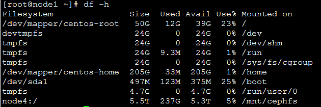

**2.bs=4k的写入速度**

输入

    dd bs=4k count=1000000 if=/dev/zero of=/mnt/cephfs/a1

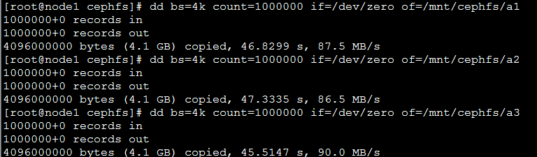

写4.1G文件，不加参数，平均速度为**88MB/s**

输入

    dd bs=4k count=1000000 if=/dev/zero of=/mnt/cephfs/b1 conv=fsync
    
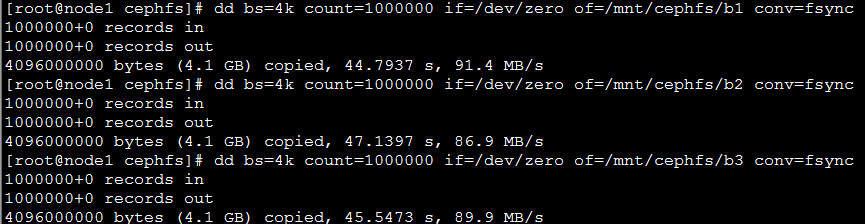

写4.1G文件，带**conv=fsync**参数，平均速度为**89.4MB/s**

输入

    dd bs=4k count=10000 if=/dev/zero of=/mnt/cephfs/c1 oflag=sync
    
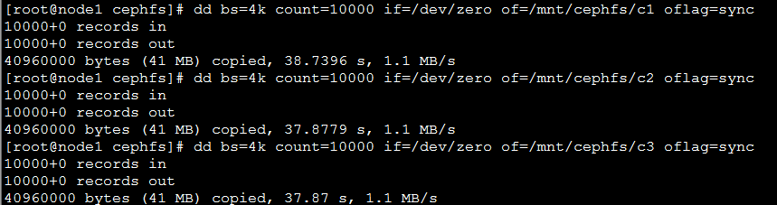

写40M文件，带**oflag=sync**参数，平均速度为**1.1MB/s**

输入

    dd bs=4k count=10000 if=/dev/zero of=/mnt/cephfs/d1 oflag=direct
    
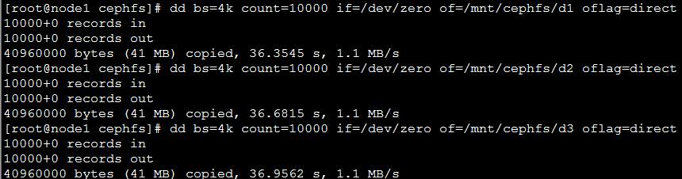

写40M文件，带**oflag=direct**参数，平均速度为**1.1MB/s**

**3.bs=1M的写入速度**

输入

    dd bs=1M count=4000 if=/dev/zero of=/mnt/cephfs/e1
    
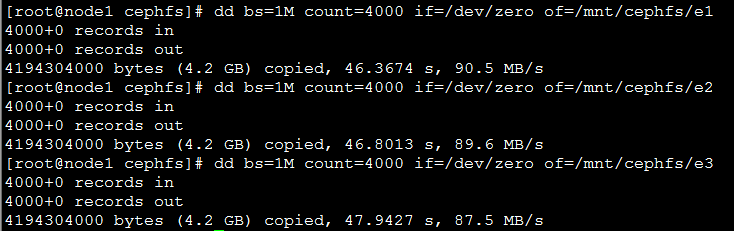

写4.1G文件，不加参数，平均速度为**89.2MB/s**

输入

    dd bs=1M count=1000 if=/dev/zero of=/mnt/cephfs/f1 conv=fsync
    
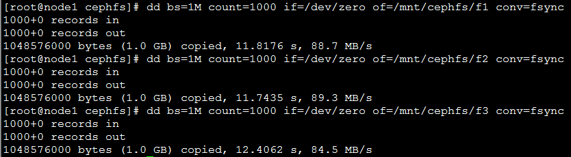

写1G文件，带**conv=fsync**参数，平均速度为**87.5MB/s**

输入

    dd bs=1M count=1000 if=/dev/zero of=/mnt/cephfs/g1 oflag=sync
    
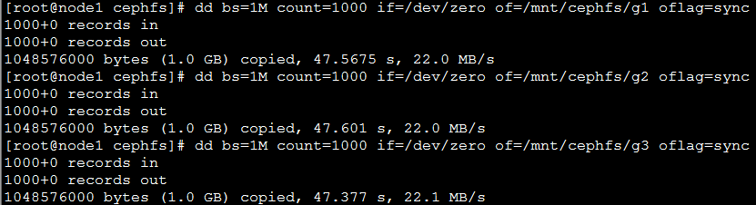

写1G文件，带**oflag=sync**参数，平均速度为**22.0MB/s**

输入

    dd bs=1M count=1000 if=/dev/zero of=/mnt/cephfs/h1 oflag=direct
    
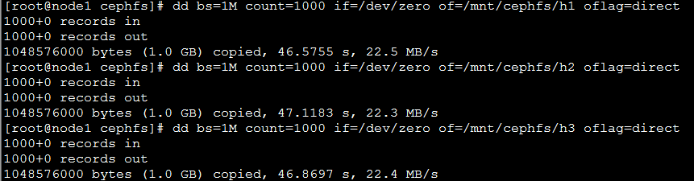

写1G文件，带**oflag=direct**参数，平均速度为**22.4MB/s**
