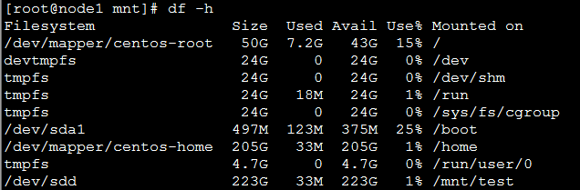
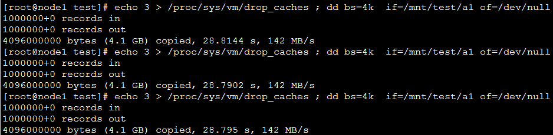
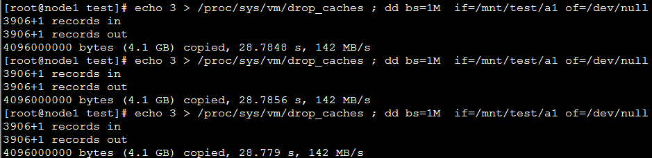

# dd读-ssd单盘

## 单机测试

**1.设备挂载**

在node1下，将物理盘/dev/sdb挂载到/mnt/test。

**2.bs=4k的读出速度**

输入

    echo 3 > /proc/sys/vm/drop_caches ; dd bs=4k  if=/mnt/test/a1 of=/dev/null

读4.1G文件，每次读4k，平均速度为**142MB/s**

**3.bs=1M的读出速度**

输入

    echo 3 > /proc/sys/vm/drop_caches ; dd bs=1M  if=/mnt/test/a1 of=/dev/null
    

读4.1G文件，每次读1M，平均速度为**142MB/s**
