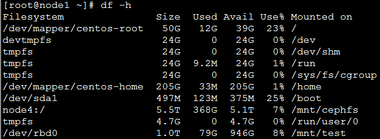
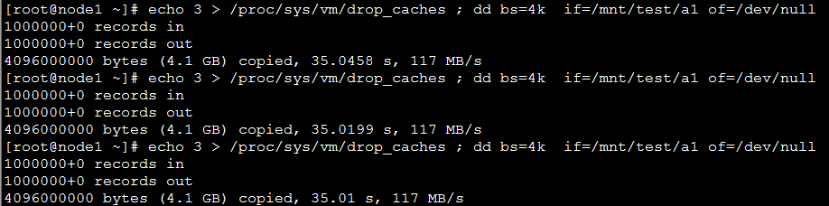
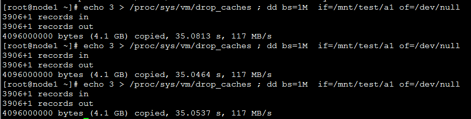
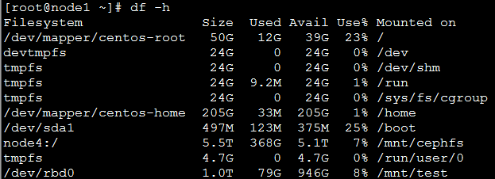
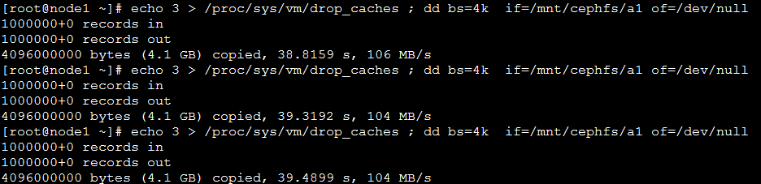
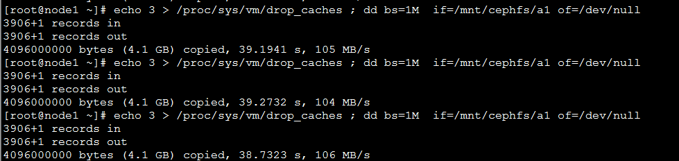

# dd读-集群双网卡

## 集群测试(RBD-块存储)

**1.设备挂载**

在node1下，进入容器client创造块设备后，将块设备/dev/rbd0挂载到/mnt/test1下。

**2.bs=4k的读出速度**

输入

    echo 3 > /proc/sys/vm/drop_caches ; dd bs=4k  if=/mnt/test1/a1 of=/dev/null

读4.1G文件，每次读4k，平均速度为**117MB/s**

**3.bs=1M的读出速度**

输入

    echo 3 > /proc/sys/vm/drop_caches ; dd bs=1M  if=/mnt/test1/a1 of=/dev/null
    

读4.1G文件，每次读1M，平均速度为**117MB/s**

---

## 集群测试(CephFS-文件存储)

**1.设备挂载**

将CephFS设备挂载到/mnt/cephfs下。

**2.bs=4k的读出速度**

输入

    echo 3 > /proc/sys/vm/drop_caches ; dd bs=4k  if=/mnt/cephfs/a1 of=/dev/null

读4.1G文件，每次读4k，平均速度为**105MB/s**

**3.bs=1M的读出速度**

输入

    echo 3 > /proc/sys/vm/drop_caches ; dd bs=1M  if=/mnt/cephfs/a1 of=/dev/null
    

读4.1G文件，每次读1M，平均速度为**105MB/s**
